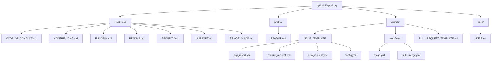

# .github
Community health files for the *NsdHSO* organization

## Overview

This repository contains the community health files and configurations for the *NsdHSO* organization on GitHub. It serves as a centralized location for maintaining standards, guidelines, and automated workflows that promote a healthy and collaborative open-source community.

The repository includes essential files such as code of conduct, contribution guidelines, security policies, and issue/PR templates that help manage the project's interactions and contributions effectively.

## Purpose

The primary purpose of this `.github` repository is to:

- Establish community standards and expectations
- Provide templates for consistent issue and pull request submissions
- Automate triage and merging processes
- Offer support and security information
- Facilitate funding and sponsorship opportunities

## File Structure

Below is a comprehensive list of all files and directories in this repository, along with their purposes:

### Root Level Files

- **CODE_OF_CONDUCT.md**: Defines the code of conduct for community members, outlining expected behaviors and consequences for violations.
- **CONTRIBUTING.md**: Provides guidelines for contributing to the project, including communication styles, pull request processes, and coding tips.
- **FUNDING.yml**: Configuration for GitHub Sponsors, listing supported funding platforms.
- **README.md**: This file, providing an overview of the repository.
- **SECURITY.md**: Security policy, including bug bounty information and reporting procedures.
- **SUPPORT.md**: Support resources and community channels for getting help.
- **TRIAGE_GUIDE.md**: Guide for the triage team on handling issues and pull requests.

### profile/ Directory

- **profile/README.md**: Content for the organization's GitHub profile README.

### .github/ Directory

#### ISSUE_TEMPLATE/
- **bug_report.yml**: Template for reporting bugs, with structured fields for description, reproduction steps, and environment details.
- **feature_request.yml**: Template for requesting new features or improvements.
- **new_request.yml**: Template for general new feature requests.
- **config.yml**: Configuration for issue templates, including contact links.

#### workflows/
- **triage.yml**: GitHub Actions workflow for automating issue triage based on comments.
- **auto-merge.yml**: Workflow for automatically merging pull requests labeled with 'merge-ready'.

#### PULL_REQUEST_TEMPLATE.md
- Template for pull requests, ensuring consistent formatting and required information.

### .idea/ Directory
- IDE-specific files for IntelliJ IDEA or similar editors (typically ignored in version control).

## Repository Diagram

## How to Use This Repository

1. **For Maintainers**: Customize the templates and guidelines to fit your project's needs. Update placeholders (like "*NsdHSO* organization" or "NsdHSO") with your actual organization/project details.

2. **For Contributors**: Refer to CONTRIBUTING.md for guidelines on how to contribute. Use the provided templates when creating issues or pull requests.

3. **Community Management**: Use the triage guide to manage incoming issues efficiently. Leverage the automated workflows to streamline processes.

4. **Security and Support**: Direct users to SECURITY.md for vulnerability reporting and SUPPORT.md for general help.

## Contributing to This Repository

To improve or update these community health files:

1. Follow the guidelines in CONTRIBUTING.md
2. Create a pull request with your changes
3. Ensure all templates and workflows are tested appropriately

## License

This repository's contents are typically licensed under the same license as the main project. Check the main repository for license details.

